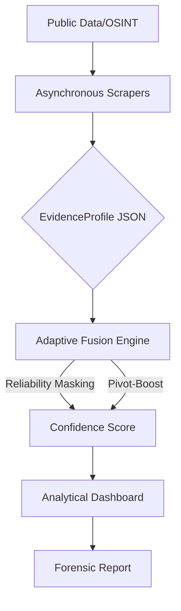

# Adaptive Identity Correlation at Scale: Explainable Multi-Modal SOCMINT for Real-Time Investigations

## 📌 Executive Summary
This project offers an automatic multi-modal solution that aims at correlating digital identities through different platforms by merging custom scraping engines and a proprietary adaptive fusion engine into one system for solving a problem of going from data to confident identity resolution to achieve lawful profiling of suspects in OSINT scenarios.

## 🗺️ System Architecture
The platform uses a hierarchical forensic pipeline that is scalable and maintains forensic integrity.



## 🚀 Getting Started (5-Minute Deployment)
To ensure reproducibility for reviewers, this tool supports containerized deployment.

### Option 1: Docker (Recommended)
1. **Clone the repository:**
   ```bash
   git clone https://github.com/DharshiniPES/social-media-intelligence-suspect-profiling.git
   ```
2. **Build the image:**
   ```bash
   docker build -t adaptive-identity-correlation .
   ```
3. **Run the container:**
   ```bash
   docker run -p 8501:8501 adaptive-identity-correlation
   ```
4. **Access the interface:** Navigate to `http://localhost:8501` in your browser.

### Option 2: Local Environment
1. **Install dependencies:** `pip install -r requirements.txt`
2. **Launch Application:** `streamlit run app.py`

## 🎥 Demo Walkthrough
[Click here to watch the full system demonstration](https://placeholder-url.com)
*(Placeholder: Replace with your YouTube/Loom link once the video is uploaded)*

## 🔬 Technical Deep Dive

### Core Innovations
*   **Reliability Masking:** Ensures that “Zero-Padding Penalties” cannot occur through the dynamic evaluation of evidence density, where blank data fields cannot artificially reduce the confidence level.
*   **Pivot-Based Boosting:** Looks for “Hard Links” (e.g. same emails, linked portfolios) and boosts the confidence level through logarithm, moving from similarity-based predictions to evidence-based linking.
*   **One-to-Many Investigative Search:** Automates iterative cluster discovery. Investigators enter a single baseline identifier, and the engine maps latent relationships across the entire database in under 2 seconds.

### Performance Validation

| Metric | Benchmark Performance | Dataset Size |
| :--- | :--- | :--- |
| System Throughput | 591 Comparisons | 100 Profiles  |
| Linkage Clusters | 18 Linked Communities | 100 Profiles  |
| Adjusted Identity Confidence | 90.0% (Case Study) | Live OSINT Data  |


## 📂 Repository Structure
```text
/
├── app.py                  # Main analytical dashboard
├── Dockerfile              # Containerization manifest
├── requirements.txt        # System dependencies
├── core/                   # Schema and Fusion logic
├── modules/                # Scrapers and Heuristic engines
└── pipeline/               # Normalization and ingestion flow
```

## 👥 Research Credits
*   **Research Interns:** Dharshini V, Tanmayi Nagabhairava
*   **Project Mentor:** Dr. Sapna V M, Dept. of Computer Science, PES University

## ⚖️ Ethical Disclaimer
This project is a prototype designed only for the legal analysis of open-source OSINT data. It was created for research purposes only. The project stays within the scope of openly available data only and does not perform any actions that could be considered unauthorized access, data breach, or any other activity that goes against laws.


---
*Documentation last updated: July 2026*