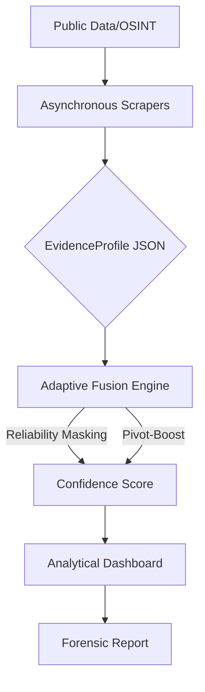

# STYLE-TRACE: Unified SOCMINT Intelligence Platform

## 📌 Executive Summary
STYLE-TRACE is an automated, multi-modal pipeline designed to correlate digital footprints across disparate platforms. By integrating custom scraping engines with a proprietary Adaptive Fusion Engine, the system bridges the gap between raw data collection and high-confidence identity resolution, providing a systematic approach to lawful suspect profiling in OSINT environments.

## 🗺️ System Architecture
The platform utilizes a layered forensic pipeline designed for scalability and forensic integrity.



## 🚀 Getting Started (5-Minute Deployment)
To ensure reproducibility for reviewers, this tool supports containerized deployment.

### Option 1: Docker (Recommended)
1. **Clone the repository:**
   ```bash
   git clone https://github.com/DharshiniPES/social-media-intelligence-suspect-profiling.git
   ```
2. **Build the image:**
   ```bash
   docker build -t style-trace .
   ```
3. **Run the container:**
   ```bash
   docker run -p 8501:8501 style-trace
   ```
4. **Access the interface:** Navigate to `http://localhost:8501` in your browser.

### Option 2: Local Environment
1. **Install dependencies:** `pip install -r requirements.txt`
2. **Launch Application:** `streamlit run app.py`

## 🎥 Demo Walkthrough
[Click here to watch the full system demonstration](https://placeholder-url.com)
*(Placeholder: Replace with your YouTube/Loom link once the video is uploaded)*

## 🔬 Technical Deep Dive

### Core Innovations
*   **Reliability Masking:** Prevents "Zero-Padding Penalties" by dynamically assessing evidence density, ensuring missing data fields do not artificially deflate confidence scores.
*   **Pivot-Based Boosting:** Identifies "Hard Links" (e.g., identical emails, linked portfolios) and applies a logarithmic confidence boost, shifting outputs from similarity-based prediction to evidence-based linkage.

### Performance Validation

| Metric | Benchmark Performance | Dataset Size |
| :--- | :--- | :--- |
| Linkage Accuracy | Pending Final Validation | 100 Profiles (4,950 comparison points) |
| False Positive Rate | Pending Final Validation | 100 Profiles (4,950 comparison points) |

## 📂 Repository Structure
```text
/
├── app.py                  # Main analytical dashboard
├── Dockerfile              # Containerization manifest
├── requirements.txt        # System dependencies
├── core/                   # Schema and Fusion logic
├── modules/                # Scrapers and Heuristic engines
└── pipeline/               # Normalization and ingestion flow
```

## 👥 Research Credits
*   **Research Interns:** Dharshini V, Tanmayi Nagabhairava
*   **Project Mentor:** Dr. Sapna V M, Dept. of Computer Science, PES University

## ⚖️ Ethical Disclaimer
This tool is a research prototype developed exclusively for the lawful correlation of open-source OSINT information. It is intended for use in academic and investigative research contexts. The project strictly adheres to the boundaries of publicly accessible data and does not engage in unauthorized access, privacy infringement, or illegal data retrieval methods.

---
*Documentation last updated: July 2026*